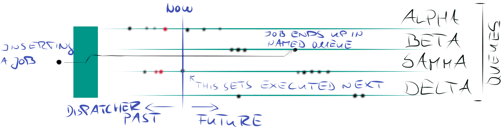

# lambdaroyal-dispatch
Job dispatching and executing library written in Clojure. Submit jobs that will be executed at specific point in time to named queues that have a configurable level of concurrency. lambdaroyal-dispatch handles hundreds of thousands of jobs on on bounded resources (threads, memory) for the price of CPU utilization

# Main features

* dispatch jobs to queues
* jobs are self-contained and given by
  - **ts** timestamp to execute (unix epoch)
  - **queue** to use
  - **λ** function with no parameters
* mark failed jobs
* rerun failed jobs 

* Named queues
  - number of jobs that are executed in parallel configurable per queue
  - pause/resume queue
  - accepts jobs not ordered by timestamp to execute

# Rationale 

Planing and executing jobs considering a certain schedule is a common task of information systems. Lambdaroyal-dispatch helps to group jobs as per the execution unit (the queue) in order to allow to pose certain concurrency constraints on jobs. Furthermore lambdaroyal-dispatch keeps track of the job state and manages resource utilization to allow for handling *hundreds of thousands* of jobs on bounded resources.

## The alternatives 

One could use Clojure's concurrency abstractions - delays, futures, promises - or even the Java abstractions. BUT one has to to take care about resource utilization and pose certain constraints on the jobs to be dispatched to achieve correct behaviour.

### Job execution order

If job A gets dispatched at dispatch time (DT) DT1 for execution time (ET) ET1 and job B gets dispatched at DT2 for execution time ET2 and the following holds true

> DT1 < DT2 < now && ET1 > ET2

then there is no guarantee using a fixed-bound thread pool that job B gets executed before job A since there is the possibility that the number of jobs that gets dispatched after job A and before job B exceeds the number of remaining threads in the bounded-size thread pool
